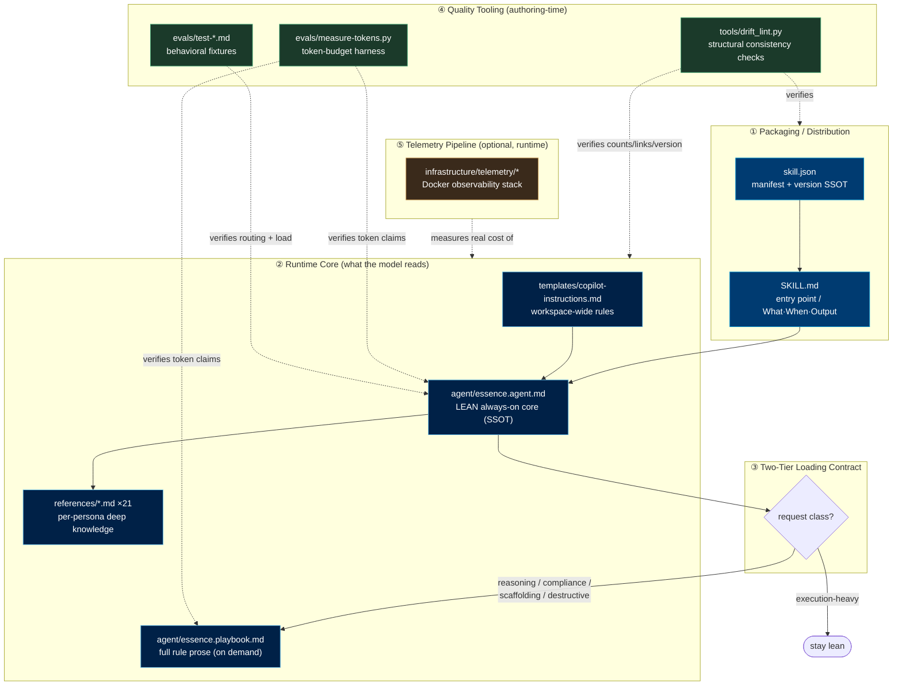
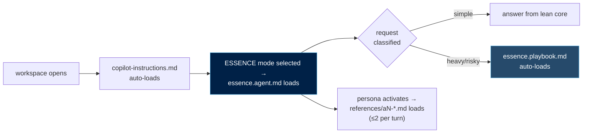
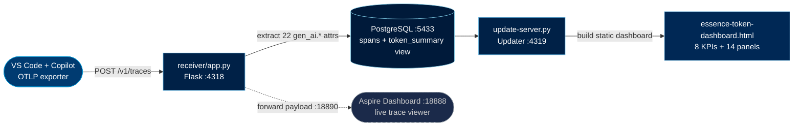
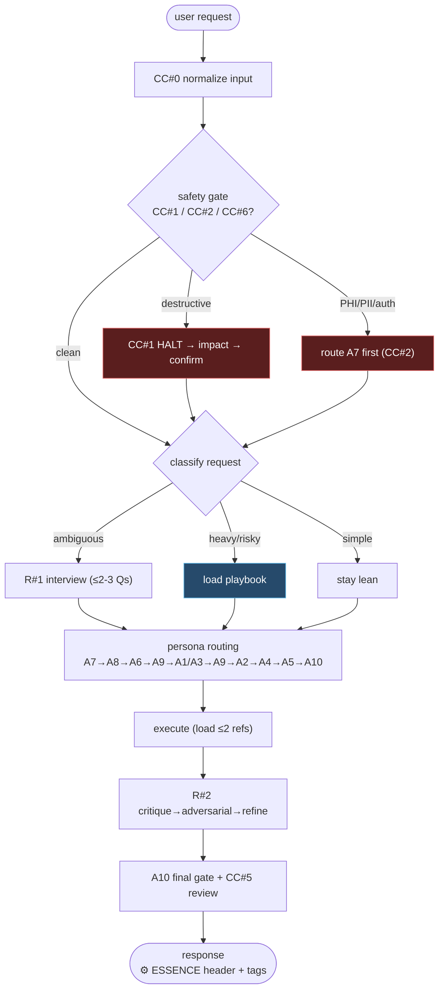

# ESSENCE — System Architecture (v2.8.0, Lean Edition)

> **Scope:** This is the full system-design document for the ESSENCE skill *as it
> exists on disk today*. It treats every file as a component with a
> responsibility, inputs, and outputs, and maps how the five subsystems connect.
>
> **Audience:** Maintainers. For the one-screen lazy-loaded summary that personas
> pull at runtime, see [`references/architecture.md`](../references/architecture.md).
>
> **Status:** Descriptive, not aspirational. Every count and path below was taken
> from the working tree; the drift-lint and token harness keep it honest.
> **Last verified:** 2026-08-11.

---

## 1. What ESSENCE actually is

ESSENCE is not an application — it is a **prompt-architecture skill** for VS Code
Copilot / Claude. It ships as a set of Markdown, JSON, and Python files
that together turn a single LLM into a 10-persona development team governed by 8
guards and 12 rules.

There is no running "ESSENCE process." The system is **a contract enforced at
three different times**:

| Enforced when | By what | Over what |
|---|---|---|
| **Authoring time** | `tools/drift_lint.py` + `evals/measure-tokens.py` | That the shipped files agree with each other and with their own claims |
| **Load time** | the two-tier loader contract in `agent/essence.agent.md` | Which prose is in context for a given request |
| **Run time** | the guards/rules/routing the model reads | How the model behaves on each turn |

The optional telemetry pipeline observes the run-time cost of that contract but
is not part of the skill's behavior.

---

## 2. The five subsystems



---

## 3. Subsystem ① — Packaging / Distribution

How the skill is published, versioned, and discovered.

| File | Responsibility | Key contract |
|---|---|---|
| [`skill.json`](../skill.json) | Marketplace manifest. **Canonical version SSOT** (`"2.8.0"`). Declares name, personas summary, 14 tags, maintainer, `docs[]` links, `installCmd`, platforms. | Every version stamp elsewhere must equal `skill.json.version`. Every `docs[].path` must resolve on disk. (both enforced by drift-lint checks #2 and #10) |
| [`SKILL.md`](../SKILL.md) | Human + agent entry point: *What / When to use / Instructions / Output Format*. Publishes the token-budget claims (`~5,200` / `~7,100`). | Token claims must match measured files within 15% (enforced by `measure-tokens.py`). All relative links must resolve (check #9). |
| [`CHANGELOG.md`](../CHANGELOG.md) | Semver history. Head entry `## [2.8.0]` is version-synced. | Head version == `skill.json.version` (check #2). |

**Rejection boundary (also packaging):** `agent/essence.agent.md` declares
`REJECT[4]` — four out-of-scope domains (data-pipelines, cortex-agents, ML
lifecycle, tableau) that ESSENCE refuses and redirects to dedicated sibling
skills. This keeps the skill's scope honest at the manifest level.

---

## 4. Subsystem ② — Runtime Core

This is what actually ends up in the model's context window. Load order matters.



### 4.1 Files

| File | Always in context? | Responsibility |
|---|---|---|
| [`templates/copilot-instructions.md`](../templates/copilot-instructions.md) | Yes (workspace-wide) | Shared rules scaffold dropped into a consuming repo's `.github/`. Carries the CC#0 normalization item and baseline conventions. |
| [`agent/essence.agent.md`](../agent/essence.agent.md) | Yes (ESSENCE mode) | **The lean core and the structural SSOT.** ~5,200 text tokens. Holds 8 guards, a 12-rule *index* (one line each), routing table, chains, rejection list, 21-file reference catalog, the **playbook auto-load contract**, and a **Platform Adaptation** clause mapping named tools (`vscode_askQuestions`, `session_store_sql`, `runSubagent`, browser tools) to the nearest host-equivalent so the same core runs on both declared platforms (`claude`, `copilot`). All counts are declared in TOON blocks (`GUARDS[8]`, `RULES[12]`, `ROUTING[11]`, `CHAINS[4]`, `REJECT[4]`, `REFS[21]`, `PLAYBOOK-LOAD`, `FOOTER[4]`). Its **CC#3** and **R#8** definitions anchor Context7 / live-docs verification in this always-on core, so source-driven development holds regardless of which model runs ESSENCE; the deep query triggers and the EXISTS/SIGNATURE/RETURNS/VERSION/IMPORT/DIALECT checklist live on-demand in [`references/knowledge-sources.md`](../references/knowledge-sources.md). |
| [`agent/essence.playbook.md`](../agent/essence.playbook.md) | On demand | Full prose for all 8 guards (`**CC#N — …**`) and 12 rules (`**R#N · …**`). ~7,100 text tokens; **0 tokens on simple tasks.** Loaded only for reasoning-heavy / compliance / scaffolding / destructive requests. |
| [`references/*.md`](../references/) ×21 | On demand, ≤2/turn | Deep per-persona and cross-cutting knowledge. Named `aN-*.md` per persona (A1–A10) plus cross-cutting (`architecture`, `knowledge-sources`, `shared-protocols`, `confluence-publishing`, `chronicle-session-history`). The active persona pulls only what the routing table maps. |

### 4.2 The 10 personas (routing targets)

A1 Development · A2 Testing · A3 UX · A4 Documentation · A5 Infrastructure ·
A6 BA/Systems · A7 Security · A8 Project Management · A9 Reusable Components ·
A10 Quality Control. Routing order and dependencies live in the `ROUTING[11]`
block; A7 is forced first on any auth/PHI/PII/prod/destructive request.

---

## 5. Subsystem ③ — The Two-Tier Loading Contract

This is the heart of the "lean edition" and the thing most likely to silently
break, so it has its own dedicated lint check (#12) and behavioral eval.

**The contract (declared in `PLAYBOOK-LOAD` inside `essence.agent.md`):**

| Request class | Action |
|---|---|
| REASONING-HEAVY (multi-file design, tradeoffs) | **LOAD** playbook |
| COMPLIANCE (PHI/PII, auth, production) | **LOAD** playbook (+ A7 first) |
| SCAFFOLDING (new project, framework migration) | **LOAD** playbook |
| DESTRUCTIVE (irreversible op) | **LOAD** playbook (+ CC#1 halt) |
| EXECUTION-HEAVY (single-file fix, rename, format, doc-gen, status) | **STAY LEAN** |

**Why it matters:** every category that says LOAD trades tokens for rigor; the
single STAY-LEAN category is where all the savings come from. Inverting one row
silently destroys either the savings or the rigor — which is exactly what
drift-lint check #12 and `evals/test-lean-load-behavior.md` exist to catch.

**Cross-file invariant:** the four LOAD categories named in the core must also be
restated in the playbook's "When it loads" note. Check #12 verifies this *scoped
to that note only*, so a dropped category can't hide behind the same word
appearing elsewhere in the playbook.

---

## 6. Subsystem ④ — Quality Tooling (authoring-time)

These never ship to the model; they protect the maintainer from drift. The
governing principle: **a passing-only check is worthless** — every check is
proven against a deliberately mutated copy that must make it fail.

| File | Kind | What it guarantees |
|---|---|---|
| [`tools/drift_lint.py`](../tools/drift_lint.py) | Deterministic, exit 0/1 | **Structural consistency checks** across 12 groups: SSOT count self-consistency (TOON `[N]` == real rows), version sync across all stamps, guard/rule presence + stale-pattern bans, architecture reference count, rejection-domain coverage in the text SSOT (agent.md REJECT block + SKILL.md), mojibake detection, error-envelope keys, playbook↔core ID coverage, link integrity, `skill.json` schema, TOON syntax/arity, and the auto-load contract. |
| [`evals/measure-tokens.py`](../evals/measure-tokens.py) | Deterministic, exit 0/1 | **Finding-H verifier.** Measures `agent.md` + `playbook.md` with a dependency-free chars/4 estimator (tiktoken optional, info-only) and fails if a `~N text tokens` claim in `SKILL.md` drifts >15% from the measured file. Stops efficacy claims from rotting into fiction. |
| [`evals/test-*.md`](../evals/) ×7 | Manual, model-in-the-loop | Behavioral fixtures a static tool can't prove: routing equivalence, critical-constraint firing, reference-loading discipline, output format, A6 modeling, basic smoke, and **`test-lean-load-behavior.md`** (the runtime half of finding H — 3 stay-lean + 4 load cases). |
| [`evals/run-ab-eval.ps1`](../evals/run-ab-eval.ps1), [`RESULTS.md`](../evals/RESULTS.md), [`review-pfizer-token-optimizer.md`](../evals/review-pfizer-token-optimizer.md) | Harness + records | A/B comparison runner and historical results. **Caveat:** the last recorded A/B run predates the lean split and must be re-run before any pass-rate is quoted. |
| [`examples/*.md`](../examples/) ×2 | Reference | Worked outputs (`basic`, `a6-order-management`) showing expected response shape. |

**Run both gates:**
```powershell
cd path/to/essence-dev-team
powershell -NoProfile -ExecutionPolicy Bypass -File tools/release_check.ps1   # drift_lint + token budget, must exit 0
```

---

## 7. Subsystem ⑤ — Telemetry Pipeline (optional, runtime)

A self-contained Docker stack under [`infrastructure/telemetry/`](../infrastructure/telemetry/)
that measures the *real* token cost of running ESSENCE. It is decoupled — the
skill works with the stack absent — and is auto-suggested on first session.



| File | Role |
|---|---|
| [`setup.py`](../infrastructure/telemetry/setup.py) | One-command install: copies stack to `~/.essence-telemetry/`, starts 4 containers, writes VS Code OTLP settings, opens dashboard. `--uninstall` tears down. |
| [`docker-compose.yml`](../infrastructure/telemetry/docker-compose.yml) | Defines 4 services: `postgres` (5433), `receiver` (4318), `aspire` (18888), `updater` (4319). |
| [`receiver/app.py`](../infrastructure/telemetry/receiver/app.py) + `Dockerfile` + `requirements.txt` | Flask OTLP endpoint: parses spans via a `GEN_AI_KEYS` map (22 attributes → DB columns), writes to Postgres, forwards original payload to Aspire. |
| [`init.sql`](../infrastructure/telemetry/init.sql) | DB schema: `spans` table + `token_summary` view. |
| [`update-dashboard.py`](../infrastructure/telemetry/update-dashboard.py), [`update-server.py`](../infrastructure/telemetry/update-server.py), `updater.Dockerfile`, [`start-dashboard.cmd`](../infrastructure/telemetry/start-dashboard.cmd) | Query Postgres and (re)build the static HTML dashboard; serve the in-page "Refresh Data" button. |
| [`essence-token-dashboard.html`](../infrastructure/telemetry/essence-token-dashboard.html) | The generated dashboard: cost by model, cache efficiency, token composition, TTFT distribution, cumulative timeline. |
| [`DATA-FLOW-MAP.md`](../infrastructure/telemetry/DATA-FLOW-MAP.md), [`README.md`](../infrastructure/telemetry/README.md) | The authoritative OTLP-attribute → column → panel mapping and ops guide. |
| [`pricing.py`](../infrastructure/telemetry/pricing.py), [`DASHBOARD_COST_SOURCE.md`](../infrastructure/telemetry/DASHBOARD_COST_SOURCE.md) | Single-source-of-truth Copilot credit pricing table (shared by `update-dashboard.py` and `full-summary.py`) and the doc explaining how the credit rates map to the Copilot model picker. |
| `query-summary.py`, `full-summary.py`, `.env.example` | CLI summaries and the env template (`ASPIRE_API_KEY`, DB creds). |

> **Note:** Aspire telemetry is in-memory — restarting the container loses prior
> session data. The dashboard HTML and Postgres persist.

---

## 8. Request lifecycle (control flow)

End-to-end path of a single user turn through the run-time contract.



**Session-start checks (Non-Negotiable #3, gated to workspace-grounded turns only):**
three checks piggyback on the first turn of a workspace-grounded session, each cheap
and independently skippable: (1) Token Dashboard setup check (offer activation once if
absent); (2) the Self-Update version check (throttled ≤1/24h, authenticated `gh api`
against the private `pfizer-fit/skills-oneweb` manifest — see `agent/essence.agent.md →
Self-Update` and `references/a5-infrastructure.md → ESSENCE Self-Update Runbook`); (3) a
Chronicle (`session_store_sql`) query for the last session in this workspace. A
standalone request with no workspace grounding skips all three — this is what keeps
trivial sessions free of a fixed tool-call tax.

**Platform Adaptation:** every tool name referenced above (`vscode_askQuestions`,
`session_store_sql`, `runSubagent`, browser tools, etc.) is a *capability contract*, not
a literal binding — on hosts lacking the named tool, the agent degrades to the nearest
equivalent per `agent/essence.agent.md → Platform Adaptation` rather than stalling.

**Output footer (R#12 Footer Policy, single arbitrated slot):** at most one
separator-line footer renders per response, in priority order: (1) session-start
update-available notice, (2) R#1's model-cost hint (once, if EXECUTION-HEAVY), (3)
R#8's retrospective cost note (on clean EXECUTION-HEAVY completion), (4) R#12's
turn-count context-pressure hint (T8 once, then every 4 turns from T12). Never stacked.

**Autonomous/scheduled delegation:** when R#6 delegates unattended or loop-triggered
work (not an interactive user turn), the run is isolated in its own `git worktree`
keyed by run-id, with a `/memories/repo/` registry preventing two runs from sharing one
working directory — see `references/a1-git-workflow.md → §8 Run Isolation via Worktrees`.

---

## 9. Cross-cutting invariants (what keeps it coherent)

| Invariant | Source of truth | Enforced by |
|---|---|---|
| Structural counts (8 guards, 12 rules, 21 refs, 4 rejects, 11 routes, 4 chains) | TOON `[N]` labels in `agent/essence.agent.md` | drift-lint #1, #3, #11 |
| Product version (`2.8.0`) | `skill.json.version` | drift-lint #2 (refs frontmatter, CHANGELOG head) |
| Token budget claims | the actual `agent.md` / `playbook.md` byte size | `evals/measure-tokens.py` |
| Auto-load behavior | `PLAYBOOK-LOAD` block + playbook note | drift-lint #12 + `test-lean-load-behavior.md` |
| Link & manifest integrity | files on disk | drift-lint #9 (links), #10 (`skill.json` schema) |
| No encoding corruption | shipped text/SVG | drift-lint #6 (mojibake) |

**Authoring hazards (for maintainers):**
- Never `Set-Content -Encoding utf8` on non-ASCII content → BOM + mojibake. Use
  an editor or Python `write_text(..., encoding="utf-8")`.
- `agent/essence.agent.md` is the SSOT — change a count there *first*, then run
  drift-lint to find every satellite that now disagrees.
- Python: bare `py`/`python` can fail with a Microsoft Store stub (exit 9009) on
  OneDrive-synced checkouts. Use `tools/release_check.ps1` (auto-discovers a
  working interpreter: `py -3` → `python3` → `python` → a full Python311 path)
  rather than invoking `py`/`python` directly. PowerShell chains with `;`, never `&&`.

---

## 10. Complete file inventory

| Location | Count | Purpose |
|---|---|---|
| `agent/` | 2 | Lean core (`essence.agent.md`) + full playbook (`essence.playbook.md`) |
| `references/` | 21 | Persona + cross-cutting knowledge (lazy-loaded, ≤2/turn) |
| `templates/` | 2 | `copilot-instructions.md` workspace scaffold + `vscode-settings.jsonc` recommended settings |
| `tools/` | 5 | `drift_lint.py` (structural consistency checks) + `release_check.ps1`/`.sh` (single-entry-point gate) + `render_docs.py` (derived-HTML regeneration) + `hooks/pre-commit` |
| `evals/` | 11 | 7 behavioral fixtures + `measure-tokens.py` + A/B runner + RESULTS + review |
| `examples/` | 2 | Worked reference outputs |
| `infrastructure/telemetry/` | 21 | Optional Docker observability stack (incl. `receiver/` sub-app, 3 files) |
| `docs/` | 8 | `ARCHITECTURE.md` + `.html` twin, `RELEASE-CHECKLIST.md`, `adr/` (3 ADRs), `assets/` (2 logo SVGs) |
| root | — | `skill.json`, `SKILL.md`, `CHANGELOG.md`, `ROADMAP.md`, `KNOWN-ISSUES.md`, `essence-one-view.html`, `.gitignore` |
| `_archive/` | — | Relocated non-shippable debris (excluded from the packaged/marketplace file set; kept for findability only) |
| **Domain skills (separate installs)** | — | `essence-data-pipeline-engineering`, `essence-cortex-ai-builder`, `essence-ml-methodology`, `essence-tableau-developer` |

## 11. Related documents

- **`ROADMAP.md`** — the exploration log for ideas looked at across the ESSENCE family
  (v2/v3/marketplace siblings) that were not necessarily committed to implementation, each
  with a `Shipped` / `Parked (Someday)` / `Rejected` / `Needs decision` verdict. Distinct from
  this file (describes what exists) and from `docs/adr/` (records decisions actually made).
- **`docs/adr/`** — Architecture Decision Records for accepted decisions, with context,
  consequences, and a revisit trigger.
- **`docs/RELEASE-CHECKLIST.md`** — the release procedure (version bump, CHANGELOG, gates,
  tag) that this document's §6 gates feed into.
- **`KNOWN-ISSUES.md`** — tracked quality issues with impact and status, cross-referenced
  from `ROADMAP.md` where an issue's long-term resolution is an open exploration rather than
  a scheduled fix.

