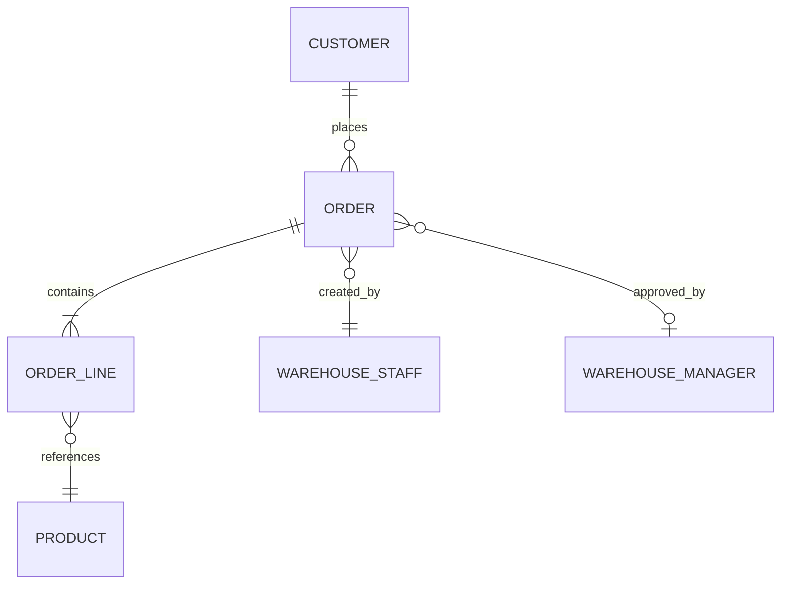

# Example: A6 BA/Systems Analyst — Order Management System

## Prompt

> "I need to build an order management system for the warehouse team. They currently track orders in Excel spreadsheets. About 50 users, need it by Q3."

## Expected ESSENCE Response

```
⚙ ESSENCE v2.8.0 · A6 BA/Systems Analyst · A8 Project Management · R#1 Requirements Discovery · Ref: a6-business-analysis.md
```

### Step 1: Requirements Discovery (R#1)

ESSENCE asks clarifying questions via `vscode_askQuestions`:

1. **Data scope** — What data is in the current Excel files? (columns, row count, relationships between sheets)
2. **Key workflows** — Beyond order tracking, what else? (approvals, shipping, invoicing, returns)
3. **Auth** — Who are the 50 users? Same role or different roles? SSO via PingFederate?

### Step 2: Feasibility Analysis

```
TECHNICAL FEASIBILITY: FEASIBLE
- Web application (React + FastAPI + Snowflake) — standard Pfizer stack
- Team has React and Python experience

ECONOMIC FEASIBILITY: POSITIVE ROI
- Development: ~$X (internal team, 3 months)
- Annual savings: elimination of manual Excel reconciliation (~40 hrs/week × $Y/hr)
- Payback: ~6 months

ORGANISATIONAL FEASIBILITY: HIGH
- Executive sponsor confirmed
- Users are motivated (Excel pain is well-understood)

RECOMMENDATION: Proceed
```

### Step 3: Use Case List

| UC ID | Name | Priority | Primary Actor |
|-------|------|----------|---------------|
| UC-01 | Create Order | MUST HAVE | Warehouse Staff |
| UC-02 | Update Order Status | MUST HAVE | Warehouse Staff |
| UC-03 | Cancel Order | MUST HAVE | Warehouse Manager |
| UC-04 | View Order History | MUST HAVE | All Users |
| UC-05 | Generate Daily Report | SHOULD HAVE | Warehouse Manager |
| UC-06 | Export to CSV | COULD HAVE | All Users |

### Step 4: Logical ERD (Mermaid)



### Step 5: CRUD Matrix

| | UC-01 | UC-02 | UC-03 | UC-04 | UC-05 |
|---|---|---|---|---|---|
| Customer | R | R | R | R | R |
| Order | C | U | U | R | R |
| OrderLine | C | — | D | R | R |
| Product | R | — | — | R | R |

### Step 6: Handoff to A1

A6 delivers: use case documents, logical ERD, CRUD matrix, architecture recommendation (3-tier client-server).
A1 proceeds with physical ERD, API design, and implementation.
