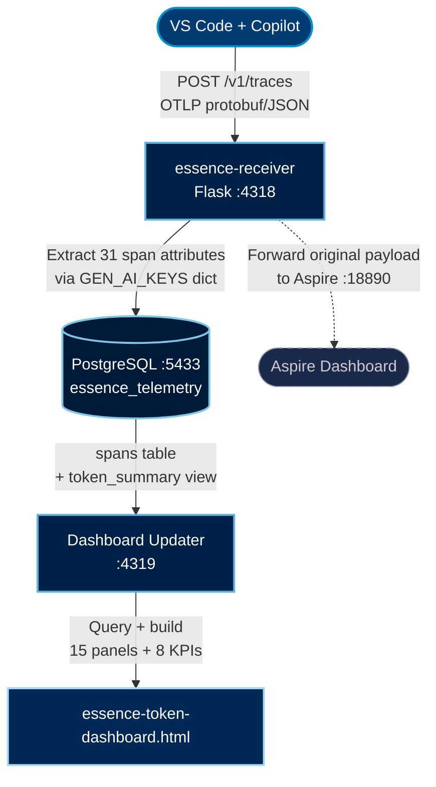
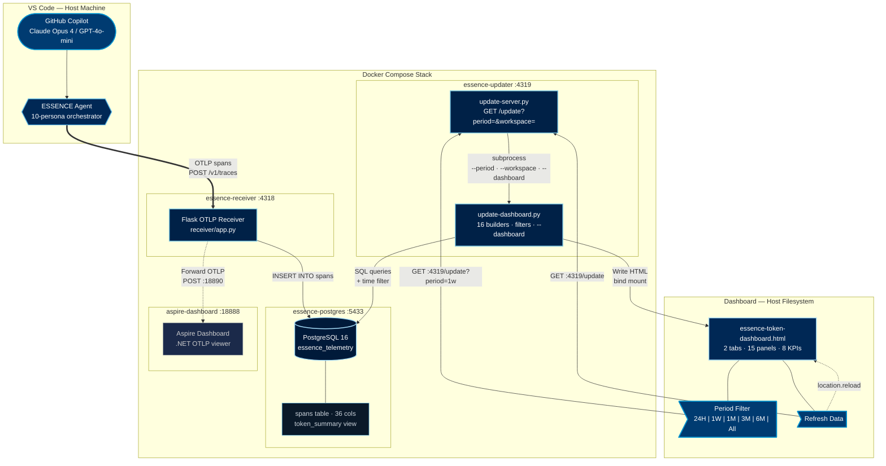
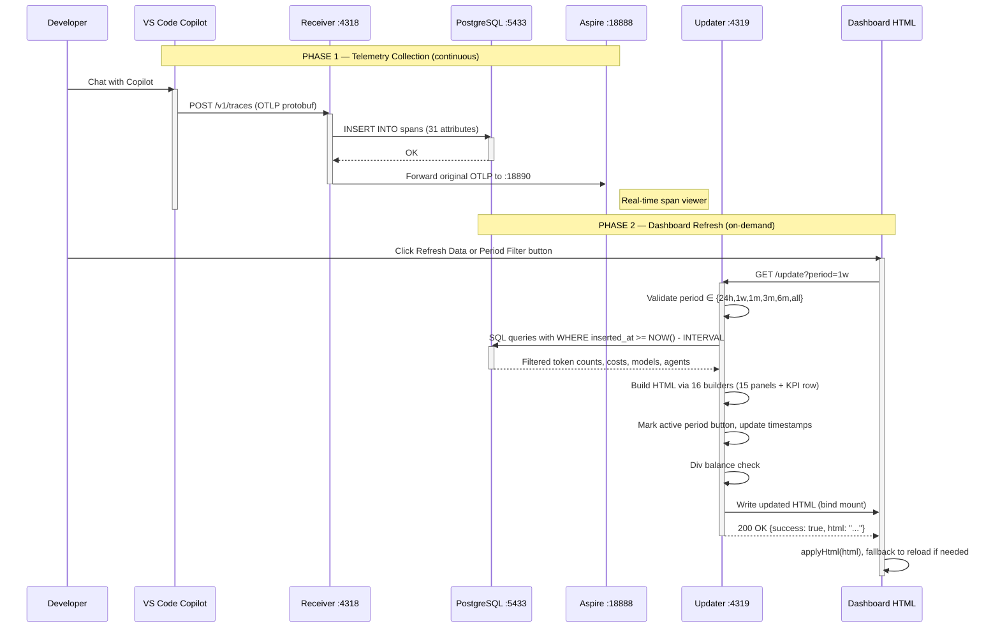

ESSENCE Telemetry — Data Flow Map

> **Purpose:** End-to-end mapping from VS Code OTLP → Receiver → PostgreSQL → Dashboard HTML.
> Use this to script automated dashboard updates without fragile string replacement.
> **Last updated:** June 5, 2026

## Current Runtime Status — June 5, 2026

The dashboard pipeline is currently running with all four Docker services up:

| Component            | Current status   | Notes                                                                                 |
| -------------------- | ---------------- | ------------------------------------------------------------------------------------- |
| `essence-postgres` | Running, healthy | Host port `5433` maps to container port `5432`; database is `essence_telemetry` |
| `essence-receiver` | Running          | Host port `4318`; receives VS Code OTLP traces and writes spans to PostgreSQL       |
| `aspire-dashboard` | Running          | Host port `18888`; receives forwarded OTLP payloads for real-time inspection        |
| `essence-updater`  | Running          | Host port `4319`; `/health` returns `{"status": "ok"}`                          |

Dashboard refresh is now path-consistent end to end:

- Source dashboard: `infrastructure/telemetry/essence-token-dashboard.html`
- Deployed dashboard: `%USERPROFILE%/.essence-telemetry/essence-token-dashboard.html`
- Docker bind mount: `${ESSENCE_DASHBOARD_DIR:-.}` → `/dashboard`
- Container dashboard path: `/dashboard/essence-token-dashboard.html`
- `update-server.py` calls `update-dashboard.py` with `--dashboard DASHBOARD_PATH`, then returns the regenerated HTML in the `/update` JSON response.
- `update-dashboard.py` defaults to the dashboard file beside the script when `DASHBOARD_PATH` is not set, preventing accidental writes to `Downloads`.
- Token figures now use dynamic compact units: raw numbers below `1K`, `K` for thousands, `M` for millions, and `B` for billions.

---

## 1. Pipeline Overview



---

## 2. OTLP Attribute → Receiver → PostgreSQL Column

| OTLP Attribute Key                           | Receiver Mapping (`GEN_AI_KEYS`)           | DB Column                 | DB Type |
| -------------------------------------------- | -------------------------------------------- | ------------------------- | ------- |
| `gen_ai.operation.name`                    | `operation_name`                           | `operation_name`        | TEXT    |
| `gen_ai.system`                            | `provider_name`                            | `provider_name`         | TEXT    |
| `gen_ai.agent.name`                        | `agent_name`                               | `agent_name`            | TEXT    |
| `gen_ai.request.model`                     | `request_model`                            | `request_model`         | TEXT    |
| `gen_ai.response.model`                    | `response_model`                           | `response_model`        | TEXT    |
| `gen_ai.usage.input_tokens`                | `input_tokens`                             | `input_tokens`          | INTEGER |
| `gen_ai.usage.output_tokens`               | `output_tokens`                            | `output_tokens`         | INTEGER |
| `gen_ai.usage.cached_tokens`               | `cached_tokens`                            | `cached_tokens`         | INTEGER |
| `gen_ai.usage.cache_read.input_tokens`     | `cached_tokens` (alias)                    | `cached_tokens`         | INTEGER |
| `gen_ai.usage.cache_creation.input_tokens` | `cache_creation_tokens`                    | `cache_creation_tokens` | INTEGER |
| `gen_ai.usage.cache_creation_input_tokens` | `cache_creation_tokens` (alias)            | `cache_creation_tokens` | INTEGER |
| `gen_ai.usage.reasoning_tokens`            | `reasoning_tokens`                         | `reasoning_tokens`      | INTEGER |
| `gen_ai.usage.reasoning.output_tokens`     | `reasoning_tokens` (alias, VS Code 1.122+) | `reasoning_tokens`      | INTEGER |
| `gen_ai.tool.name`                         | `tool_name`                                | `tool_name`             | TEXT    |
| `gen_ai.tool.call.id`                      | `tool_call_id`                             | `tool_call_id`          | TEXT    |
| `gen_ai.tool.type`                         | `tool_type`                                | `tool_type`             | TEXT    |
| `gen_ai.chat.session_id`                   | `chat_session_id`                          | `chat_session_id`       | TEXT    |
| `gen_ai.conversation.id`                   | `conversation_id`                          | `conversation_id`       | TEXT    |
| `gen_ai.turn.index`                        | `turn_index`                               | `turn_index`            | INTEGER |
| `gen_ai.response.finish_reasons`           | `finish_reasons`                           | `finish_reasons`        | TEXT    |
| `gen_ai.client.operation.duration`         | `duration_ms`                              | `duration_ms`           | REAL    |
| `gen_ai.server.time_to_first_token`        | `ttft_ms`                                  | `ttft_ms`               | REAL    |
| `copilot_chat.time_to_first_token`         | `ttft_ms` (alias)                          | `ttft_ms`               | REAL    |

**`github.copilot.*` canonical namespace** (VS Code 1.122+, dual-emitted alongside `gen_ai.*` / legacy `copilot_chat.*`; promoted from the `attributes` JSONB blob to named columns by the receiver's `migrate_schema()` and by `init.sql` on fresh volumes):

| OTLP Attribute Key                            | Receiver Mapping (`GEN_AI_KEYS`) | DB Column           | DB Type |
| --------------------------------------------- | ---------------------------------- | ------------------- | ------- |
| `github.copilot.agent.type`                 | `agent_type`                     | `agent_type`      | TEXT    |
| `github.copilot.git.repository`             | `git_repository`                 | `git_repository`  | TEXT    |
| `github.copilot.git.branch`                 | `git_branch`                     | `git_branch`      | TEXT    |
| `github.copilot.github.org`                 | `github_org`                     | `github_org`      | TEXT    |
| `github.copilot.tool.parameters.edit_type`  | `tool_edit_type`                 | `tool_edit_type`  | TEXT    |
| `github.copilot.tool.parameters.skill_name` | `tool_skill_name`                | `tool_skill_name` | TEXT    |
| `github.copilot.hook.decision`              | `hook_decision`                  | `hook_decision`   | TEXT    |
| `github.copilot.hook.duration`              | `hook_duration_s`                | `hook_duration_s` | REAL    |

> `github.copilot.cost` and `github.copilot.aiu` are **CLI-only** — VS Code copilot-chat spans do not emit them, so the dashboard derives cost from token counts via the `PRICING` table rather than these keys. Legacy `copilot_chat.*` spans carry no repo/agent/hook context, so these columns stay NULL for pre-1.122 data.

**Non-attribute columns** (derived from span envelope, not attributes):

| Span Envelope Field           | DB Column          | DB Type     |
| ----------------------------- | ------------------ | ----------- |
| `span.span_id`              | `span_id`        | TEXT        |
| `span.trace_id`             | `trace_id`       | TEXT        |
| `span.parent_span_id`       | `parent_span_id` | TEXT        |
| `span.name`                 | `name`           | TEXT        |
| `span.start_time_unix_nano` | `start_time_ms`  | BIGINT      |
| `span.end_time_unix_nano`   | `end_time_ms`    | BIGINT      |
| `span.status.code`          | `status_code`    | INTEGER     |
| `span.status.message`       | `status_message` | TEXT        |
| (auto)                        | `inserted_at`    | TIMESTAMPTZ |
| (overflow)                    | `attributes`     | JSONB       |

---

## 3. PostgreSQL Queries → Dashboard Fields

All queries accept an optional time filter via `--period` flag (see §3.17).

### 3.1 KPI Cards

KPI cards live inside `<div class="kpi-row">`. Each card structure:

```html
<div class="kpi {COLOR}">
  <div class="label">{LABEL}</div>
  <div class="value">{VALUE}</div>
  <div class="sub">{SUBTITLE}</div>
</div>
```

| KPI Card       | CSS Class      | Label Text         | SQL Query                                         | Formula                           |
| -------------- | -------------- | ------------------ | ------------------------------------------------- | --------------------------------- |
| Total Tokens   | `kpi accent` | `Total Tokens`   | `SUM(input_tokens) + SUM(output_tokens)`        | `input + output`                |
| Cache Hit Rate | `kpi green`  | `Cache Hit Rate` | `SUM(cached_tokens)::float / SUM(input_tokens)` | `cached / input * 100`          |
| Total Input    | `kpi orange` | `Total Input`    | `SUM(input_tokens)`                             | all input tokens                  |
| Cached Tokens  | `kpi cyan`   | `Cached Tokens`  | `SUM(cached_tokens)`                            | prompt cache hits                 |
| Output Tokens  | `kpi red`    | `Output Tokens`  | `SUM(output_tokens)`                            | direct                            |
| Est. Cost      | `kpi yellow` | `Est. Cost`      | see Cost Formula below                            | rounded Copilot credits,`~N Cr` |
| LLM Calls      | `kpi purple` | `LLM Calls`      | `COUNT(*) WHERE input_tokens > 0`               | count of gen_ai spans             |
| Wall Clock     | `kpi pink`   | `Wall Clock`     | `MAX(inserted_at) - MIN(inserted_at)`           | formatted as `Xd Yh Zm`         |

> Card order matches `build_kpi_row()`: Total Tokens → Cache Hit Rate → Total Input → Cached Tokens → Output Tokens → Est. Cost → LLM Calls → Wall Clock. (There is no standalone "Spans" KPI card; the cyan card is **Cached Tokens**. The `Spans` total is shown in the session banner / `total_spans`, not a KPI.)

### 3.2 Header Layout

The header combines pipeline status, data window, and period filter:

```html
<div class="live" id="pipelineStatus">
  ● Pipeline Active
  <span id="lastUpdated" style="...color:#ffffff;">(May 23, 2026 · 14:47:39)</span>
</div>
<div>
  <span class="meta-label">Data Window</span>
  <span class="meta-value">May 22, 14:47 → May 23, 14:47</span>
  <span class="meta-badge">23h 59m</span>
</div>
<div class="period-filter">
  <button class="period-btn active" data-period="24h">24H</button>
  <button class="period-btn" data-period="1w">1 Week</button>
  <button class="period-btn" data-period="1m">1 Month</button>
  <button class="period-btn" data-period="3m">3 Months</button>
  <button class="period-btn" data-period="6m">6 Months</button>
  <button class="period-btn" data-period="all">All</button>
</div>
```

| Field             | Source                                                | Format                                                    |
| ----------------- | ----------------------------------------------------- | --------------------------------------------------------- |
| Pipeline status   | JS `checkHealth()` → GET `/health`               | `● Pipeline Active` or `○ Pipeline Offline`         |
| Last updated      | Python `now_display` in `<span id="lastUpdated">` | `(Mon DD, YYYY · HH:MM:SS)`                            |
| Data window start | `MIN(inserted_at)`                                  | `Mon DD, HH:MM` local time                              |
| Data window end   | `MAX(inserted_at)`                                  | `Mon DD, HH:MM` local time                              |
| Duration badge    | `MAX(inserted_at) - MIN(inserted_at)`               | `Xd Yh MMm` / `Yh MMm` / `Mm`                       |
| Active period     | `--period` arg → `data-period` attribute         | CSS `.period-btn.active` (default `all` when no flag) |

### 3.3 Cost by Model Table (V4)

Heading: `Cost by Model`. Tab: Health.

| Column | Header                                          | Format        |
| ------ | ----------------------------------------------- | ------------- |
| Model  | `<span class="model-tag {type}">`             | model name    |
| Cost   | `<td class="r" style="color:var(--yellow);">` | `~N Cr`     |
| Input  | `<td class="r">`                              | `N,NNN,NNN` |
| Output | `<td class="r">`                              | `N,NNN`     |

### 3.4 Cache Efficiency Ring (V5)

Heading: `Cache Efficiency`. Tab: Health. Contains SVG donut ring + stats.

| Element            | Notes                                       |
| ------------------ | ------------------------------------------- |
| Ring fill          | `stroke-dashoffset = 440 * (1 - pct/100)` |
| Center %           | `{pct}%` in green                         |
| Total input/output | formatted below ring                        |

### 3.5 Token Composition Bars (V6)

Heading: `Token Composition`. Tab: Health. Stacked horizontal bars per model.

### 3.6 Token Breakdown Table (V8)

Heading: `Token Breakdown by Model`. Tab: Health.

Columns: Model, Calls, Input, Output, Cached, Cache %, Cache Write, Avg TTFT, Cost.

### 3.7 Efficiency Panel (V9)

Heading: `V9 —`. Tab: Health (positioned under V1). Three-card grid layout.

| Card                 | Metric                              | Unit       |
| -------------------- | ----------------------------------- | ---------- |
| Output/Input Ratio   | `SUM(output) / SUM(input) * 100`  | `%`      |
| Output per Tool Call | `SUM(output) / COUNT(tool spans)` | `tokens` |
| Avg Input per Call   | `SUM(input) / COUNT(llm spans)`   | `tokens` |

Cards use `grid-template-columns: repeat(3, 1fr)` for equal width.

### 3.8 Tokens per LLM Call Chart (V3)

Heading: `Tokens per LLM Call`. Tab: Analysis. Top 20 horizontal bar chart.

### 3.9 Cumulative Tokens & Cost Chart (V7)

Heading: `Cumulative Tokens`. Tab: Analysis. CSS polygon area chart.

### 3.10 TTFT Box-Whisker Chart (V10)

Heading: `Time to First Token`. Tab: Analysis. Box-whisker per model.

Percentiles: min, p25, median, p75, p95, max.

### 3.11 Internal Agent Types (V11)

Heading: `Internal Agent Types`. Tab: Analysis. Table of agent_name counts + token totals.

### 3.12 Tools & Finish Reasons (V12)

Heading: `Tools`. Tab: Analysis. Table of tool_name counts + avg duration.

### 3.12b Workspace and Agent Context (V14b)

Heading: `Workspace and Agent Context`. Tab: Analysis. Built by `build_github_context()` from the `github.copilot.*` named columns (VS Code 1.122+). Five sub-tables: agent type (builtin/custom/plugin), repository (top 10 by input tokens, with branch), edit type (create/update/str_replace/insert), skill invocations, and hook outcomes (pass/block/non_blocking_error + avg duration). Degrades to a hint row when the source DB is un-migrated or the selected period has no `github.copilot.*` data. Queries are guarded by an `information_schema` column probe so an un-migrated DB never aborts the whole refresh.

### 3.13 Context Growth (V13)

Heading: `Context Growth`. Tab: Analysis. Per-turn input token growth chart.

### 3.14 Session Length Impact (V14)

Heading: `Session Length Impact`. Tab: Analysis.

Buckets: 1-5, 6-15, 16-30, 31+ spans per trace. Bar chart with severity colors.

### 3.15 Hourly Consumption (V15)

Heading: `Hourly Consumption`. Tab: Analysis. Horizontal bar chart of net billable tokens per hour.

### 3.16 Usage Insights (V1)

Heading: `Usage Insights`. Tab: Health. Dynamic recommendation cards.

Generated by `build_recommendations()` which evaluates:

1. **A. Long Sessions** — >25% of input from 31+ span sessions → HIGH
2. **B. Background Agent** — backgroundTodoAgent with <30% cache and >500K billable → HIGH
3. **C. Low Cache Efficiency** — any agent with <50% cache and >100K billable → MEDIUM
4. **D. Model Cost Imbalance** — top model >50x all others combined → MEDIUM
5. **E. Frequent File Reads** — >50 read_file calls → MEDIUM
6. **F. Cache Hit Rate** — >90% overall → OK (healthy)

Cards use `flex:1 1 0%;min-width:0;` for equal width. Each card has letter prefix (`A.`, `B.`, etc.) and friendly agent names via `friendly_agent()` mapping:

```python
{'backgroundTodoAgent': 'Background Agent',
 'summarizeConversationHistory-full': 'Low Cache',
 'summarizeConversationHistory': 'Low Cache',
 'panel/editAgent': 'Edit Agent',
 'panel/chat': 'Chat Panel',
 'copilot-chat': 'Copilot Chat',
 'inline/completions': 'Inline Completions'}
```

### 3.17 Period Time Filter

The `--period` CLI argument adds a `WHERE inserted_at >= NOW() - INTERVAL 'X'` clause to ALL queries in `fetch_all_data()`.

```python
PERIOD_MAP = {
    '24h':  '1 day',
    '1w':   '7 days',
    '1m':   '1 month',
    '3m':   '3 months',
    '6m':   '6 months',
    'all':  None,      # no filter
}
```

Flow: Browser `filterPeriod('1w')` → JS `fetch('/update?period=1w')` → `update-server.py` parses `?period=` → passes `--period 1w` to `update-dashboard.py` → SQL time filter applied → HTML rewritten → browser reloads.

### 3.18 Session Banner

**SQL** (in `fetch_all_data()`):

```sql
SELECT trace_id, COUNT(*) as span_count,
       COUNT(*) FILTER (WHERE input_tokens IS NOT NULL AND input_tokens > 0) as llm_turns
FROM spans WHERE trace_id IS NOT NULL {time_filter}
GROUP BY trace_id
HAVING COUNT(*) >= 3          -- skip inline-completion noise (1-2 span traces)
ORDER BY MAX(inserted_at) DESC
LIMIT 1
```

**HTML target:** `<div class="session-banner">` — regex-replaced in `main()` (not a panel builder).

| Element       | Source                | Notes                                                                                            |
| ------------- | --------------------- | ------------------------------------------------------------------------------------------------ |
| Span count    | `latest_span_count` | Total spans in the latest qualifying trace                                                       |
| Turn count    | `latest_turn_count` | `COUNT(*) FILTER (WHERE input_tokens > 0)` — proxy for LLM turns (`turn_index` is always 0) |
| Warning state | CSS class `.over`   | Applied when turns > 15; changes border/background to red, shows CTA                             |

---

## 4. Solution Architecture

### 4.1 System Overview



### 4.2 Container Inventory

| # | Container            | Image                                         | Port         | Purpose                                          | Depends On         |
| - | -------------------- | --------------------------------------------- | ------------ | ------------------------------------------------ | ------------------ |
| 1 | `essence-postgres` | `postgres:16-alpine`                        | 5433→5432   | Persistent span storage                          | —                 |
| 2 | `essence-receiver` | Custom (Flask)                                | 4318→4318   | OTLP ingest, PostgreSQL writer, Aspire forwarder | postgres (healthy) |
| 3 | `aspire-dashboard` | `mcr.microsoft.com/dotnet/aspire-dashboard` | 18888→18888 | Real-time span viewer (original Aspire UI)       | —                 |
| 4 | `essence-updater`  | Custom (Python 3.12-slim)                     | 4319→4319   | Dashboard refresh API + period filter            | postgres (healthy) |

### 4.3 Data Flow Sequence



### 4.4 Volume Mounts

| Container            | Host Path                                  | Container Path                           | Purpose                   |
| -------------------- | ------------------------------------------ | ---------------------------------------- | ------------------------- |
| `essence-postgres` | Docker volume `essence-telemetry-pgdata` | `/var/lib/postgresql/data`             | Persistent DB storage     |
| `essence-postgres` | `./init.sql`                             | `/docker-entrypoint-initdb.d/init.sql` | Schema bootstrap          |
| `essence-updater`  | `${ESSENCE_DASHBOARD_DIR:-.}`            | `/dashboard`                           | Dashboard HTML read/write |

### 4.5 Network Topology

All containers share the default Docker bridge network. Internal hostnames resolve via Docker DNS:

| From         | To           | Protocol | Internal Address           |
| ------------ | ------------ | -------- | -------------------------- |
| `receiver` | `postgres` | TCP/SQL  | `postgres:5432`          |
| `receiver` | `aspire`   | HTTP     | `http://aspire:18890`    |
| `updater`  | `postgres` | TCP/SQL  | `postgres:5432`          |
| Host browser | `updater`  | HTTP     | `http://localhost:4319`  |
| Host browser | `aspire`   | HTTP     | `http://localhost:18888` |
| VS Code      | `receiver` | HTTP     | `http://localhost:4318`  |

### 4.6 Key Files

| File                             | Location                               | Role                                                                                                                        |
| -------------------------------- | -------------------------------------- | --------------------------------------------------------------------------------------------------------------------------- |
| `docker-compose.yml`           | `infrastructure/telemetry/`          | Defines all 4 services, volumes, networking                                                                                 |
| `receiver/app.py`              | `infrastructure/telemetry/receiver/` | OTLP parser, 31 attribute extractors, schema migrator, PostgreSQL writer                                                    |
| `receiver/Dockerfile`          | `infrastructure/telemetry/receiver/` | Flask + gunicorn image                                                                                                      |
| `init.sql`                     | `infrastructure/telemetry/`          | Schema: spans table (36 cols), token_summary view, 7 indexes                                                                |
| `update-dashboard.py`          | `infrastructure/telemetry/`          | 16 builders (15 panels + KPI), period/workspace filters, K/M/B token formatter, div-balance guard                           |
| `update-server.py`             | `infrastructure/telemetry/`          | HTTP API:`/update?period=&workspace=` triggers filtered refresh, passes `--dashboard DASHBOARD_PATH`, `/health` check |
| `updater.Dockerfile`           | `infrastructure/telemetry/`          | Python 3.12-slim + psycopg2 image                                                                                           |
| `essence-token-dashboard.html` | `infrastructure/telemetry/`          | Generated dashboard: 2 tabs, 8 KPIs, 15 panels, period/workspace filters                                                    |

### 4.7 Dashboard Tab Layout

```
┌──────────────────────────────────────────────────────────────────────┐
│  HEADER: Logo · v2.8.0 · [Refresh Data]                             │
│  ● Pipeline Active (May 23, 2026 · 14:47:39)                        │
│  DATA WINDOW  May 22, 14:47 → May 23, 14:47  [23h 59m]              │
│  PERIOD  [24H] [1 Week] [1 Month] [3 Months] [6 Months] [All]       │
├──────────────────────────────────────────────────────────────────────┤
│  KPI ROW: Total Tokens | Cache Hit | Total Input | Est. Cost |       │
│           Output | LLM Calls | Spans | Wall Clock                    │
├──────────────────────────────────────────────────────────────────────┤
│  [Health]  [Analysis]                                                │
├──────────────────────────────────────────────────────────────────────┤
│  TAB: HEALTH                                                         │
│  ┌─ Session Banner ──────────────────────────────────────────────┐   │
│  │  Current Session — X spans · Y turns                           │   │
│  └────────────────────────────────────────────────────────────────┘   │
│  ┌─ V1: Usage Insights ─────────────────────────────────────────┐   │
│  │  [A. Long Sessions] [B. Background Agent] [C. Low Cache] ... │   │
│  └───────────────────────────────────────────────────────────────┘   │
│  ┌─ V9: Efficiency ─────────────────────────────────────────────┐   │
│  │  Output/Input Ratio │ Output per Tool Call │ Avg Input/Call   │   │
│  └───────────────────────────────────────────────────────────────┘   │
│  ── Cost Overview ──────────────────────────────────────────────     │
│  ┌─ V4 ──────┐ ┌─ V5 ──────┐ ┌─ V6 ──────────┐                    │
│  │ Cost by    │ │ Cache     │ │ Token          │                    │
│  │ Model      │ │ Efficiency│ │ Composition    │                    │
│  └────────────┘ └───────────┘ └────────────────┘                    │
│  ┌─ V8: Token Breakdown by Model ───────────────────────────────┐   │
│  │  Full 9-column breakdown table                                │   │
│  └───────────────────────────────────────────────────────────────┘   │
├──────────────────────────────────────────────────────────────────────┤
│  TAB: ANALYSIS                                                       │
│  V3:  Tokens per LLM Call (Top 20)                                   │
│  V7:  Cumulative Tokens & Cost                                       │
│  V10: Time to First Token (TTFT percentiles)                         │
│  V11: Internal Agent Types                                           │
│  V12: Tools & Finish Reasons                                         │
│  V13: Context Growth per Agent Turn                                  │
│  V14: Session Length Impact                                          │
│  V15: Hourly Consumption                                             │
└──────────────────────────────────────────────────────────────────────┘
```

---

## 5. Panel Replacement Engine

### 5.1 `replace_panel_content(html, heading_text, new_content)`

Finds a panel by matching `heading_text` inside `<h2>` tags using regex:

```python
pattern = re.compile(r'<h2[^>]*>[^<]*' + re.escape(heading_text))
```

Then counts `<div>`/`</div>` pairs from the heading's parent `<div>` to find the panel boundary. Replaces content between `</h2>` and the panel's closing `</div>`.

**Key fix:** Uses `<h2>` tag-scoped regex to avoid false matches against heading text that appears inside panel content (e.g., "Cache Efficiency" inside a recommendation card titled "Low Cache Efficiency").

### 5.2 Panel Build Order (15 panels)

```python
panels = [
    ('Cost by Model',           build_cost_table),        # V4
    ('Cache Efficiency',        build_cache_ring),         # V5
    ('Token Composition',       build_token_composition),  # V6
    ('Token Breakdown by Model', build_breakdown_table),   # V8
    ('V9 —',                    build_efficiency_panel),   # V9
    ('Tokens per LLM Call',     build_tokens_per_call),    # V3
    ('Cumulative Tokens',       build_cumulative_chart),   # V7
    ('Time to First Token',     build_ttft_chart),         # V10
    ('Internal Agent Types',    build_agents_table),       # V11
    ('Tools',                   build_tools_table),        # V12
    ('Workspace and Agent Context', build_github_context), # V14b
    ('Context Growth',          build_context_growth),     # V13
    ('Session Length Impact',   build_session_impact),     # V14
    ('Hourly Consumption',      build_hourly_consumption), # V15
    ('Usage Insights',          build_recommendations),    # V1
]
```

### 5.3 Div Balance Guard

Before writing, the updater verifies global `<div>` / `</div>` balance. If unbalanced, the file is NOT saved to prevent layout corruption.

---

## 6. Cost Pricing

GitHub Copilot credit rates. Per 1M tokens:

```python
PRICING = {
    'opus':         {'input': 500,  'cached':  50, 'output': 2500},
    'sonnet':       {'input': 300,  'cached':  30, 'output': 1500},
    'haiku':        {'input': 100,  'cached':  10, 'output':  500},
    'codex':        {'input': 175,  'cached':  17, 'output': 1400},
    'gpt-5.5':      {'input': 500,  'cached':  50, 'output': 3000},
    'gpt-5.4-mini': {'input':  75,  'cached':   7, 'output':  450},
    'gpt-5.4':      {'input': 250,  'cached':  25, 'output': 1500},
    'gpt-5-mini':   {'input':  25,  'cached':   2, 'output':  200},
    'gemini-flash': {'input': 150,  'cached':  15, 'output':  900},
    'gemini-pro':   {'input': 200,  'cached':  20, 'output': 1200},
    'gpt':          {'input':  25,  'cached':   2, 'output':  200},
}
```

Formula: `cost = (non_cached / 1M × input_rate) + (cached / 1M × cached_rate) + (output / 1M × output_rate)`

Display: `fmt_cost()` rounds to a whole-credit estimate and renders `~N Cr`.

---

## 7. Number Formatting

| Type           | Format                  | Example                                |
| -------------- | ----------------------- | -------------------------------------- |
| Token counts   | Comma-separated         | `1,234,567`                          |
| Compact tokens | Dynamic K/M/B suffix    | `842`, `492K`, `88.2M`, `1.2B` |
| Costs          | Tilde prefix in credits | `~71,089 Cr`                         |
| Percentages    | One decimal             | `92.3%`                              |
| TTFT           | Milliseconds            | `1,234ms`                            |
| Duration       | Days/hours/minutes      | `1d 4h 18m`                          |

---

## 8. Model Tag CSS Classes

| Model Pattern       | CSS Class          | Color Variable      |
| ------------------- | ------------------ | ------------------- |
| `claude-opus-*`   | `model-tag opus` | `--accent` (blue) |
| `claude-sonnet-*` | `model-tag opus` | `--accent` (blue) |
| `gpt-4o-mini*`    | `model-tag mini` | `--green`         |

---

## 9. Encoding Notes

- All files are UTF-8 without BOM
- Python updater reads/writes with `encoding='utf-8'`
- **Known pitfall:** PowerShell 5.1 reads UTF-8 as CP1252, creating double-encoded mojibake. Use .NET `[System.IO.File]::ReadAllLines` with `UTF8Encoding($false)` for manual edits
- `update-server.py` sets `PYTHONIOENCODING=utf-8` in subprocess env
- Special characters used: `●` (U+25CF), `·` (U+00B7), `→` (U+2192), `…` (U+2026), `—` (U+2014)
